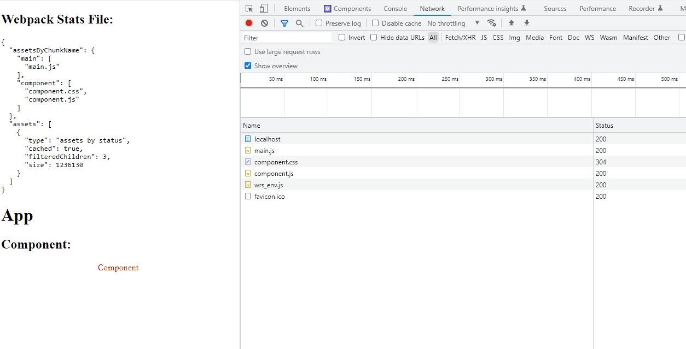
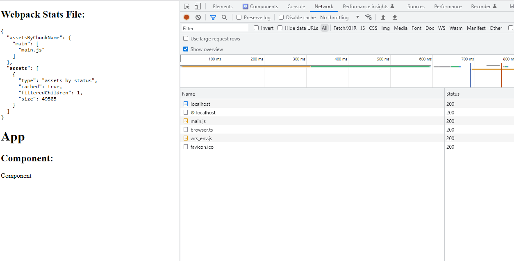

# Webpack lazy loading SSR example

This repo shows the current problem with usage of [experimental.lazyCompilation](https://webpack.js.org/configuration/experiments/#experimentslazycompilation) with SSR.

## The issue

The issue comes from fact that when lazyCompilation is enabled there is not way to gather info about chunks that will be used on page in order to provide fluent page render.

This is how page looks without lazyCompilation:

As you can see there is chunk `component` with both js and css file that can be preloaded on page

And this is how it looks with lazyCompilation:

Actual css chunk is not present in webpack stats file and this style is loaded only after page load that leads to style flashing. Also the required css is loaded only several page refreshes

## How to run it

1. Go to `webpack.config.js` and find the `lazyCompilation` option. Either enable or disable it depending on what are you want to test.
2. In one terminal run command `npm run watch` to run webpack build in watch mode
3. In second terminal run command `npm run server` to run server that provides SSR
4. Open `http://localhost:3000` in browser to see test page

## How does it work

On client it is a simple webpack build that produces js and css file that later used in browser.

On server side it is a custom fastify server that parses webpack stats file from client build in order to preload required assets for page in initial html.

You can find any additional info about implementation in the source code comments that are started with `NOTE:` string.